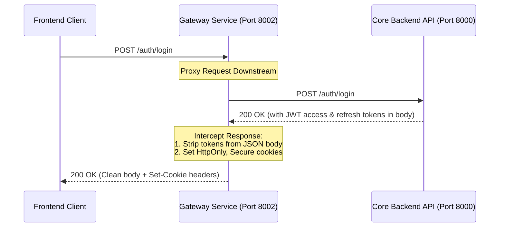

# Gateway Service

The Gateway Service serves as the unified entrypoint (Reverse Proxy and API Gateway) for all external client-side communications (web app, candidate mobile client, etc.) within the iBot platform. It manages traffic routing, security, rate limiting, and acts as the stateful-to-stateless authentication translator.

---

## Technical Stack
- **Web Framework:** [FastAPI](https://fastapi.tiangolo.com/) (Python 3.11+)
- **Asynchronous Client:** [HTTPX](https://www.python-httpx.org/) (for proxy routing)
- **Token Decryption:** [python-jose](https://github.com/mpdavy/python-jose) (for validating JWT tokens at the boundary)
- **Dependency Manager:** [uv](https://github.com/astral-sh/uv)

---

## Architecture & Authentication Flows

The Gateway intercepts and translates security headers, protecting internal backend services from dealing with cookie-based protocols directly:



### Key Security & Routing Features
1. **Stateful-to-Stateless Conversion:** Reads secure HTTP-only cookies (`access_token`, `refresh_token`) sent from the client browser, validates them, and injects stateless HTTP headers (e.g. `X-User-Id`) into request payloads forwarded downstream.
2. **Blocked Routes Protection:** Actively blocks access to internal backend routes (configured in `BLOCKED_ROUTES`) that should not be exposed externally.
3. **Silent Refresh Interception:** If an `access_token` expires mid-session, the gateway automatically catches the failure, accesses the client's `refresh_token` cookie, requests new credentials from the auth service, retries the initial request, and attaches the updated cookies to the client response.
4. **CORS & Cookies Policies:** Enforces strict Cross-Origin Resource Sharing (CORS) rules and manages SameSite/Secure cookies context-aware based on environment.

---

## Directory Structure
```text
gateway-service/
├── src/
│   ├── api/                   # HTTP gateways and middlewares
│   │   ├── middleware/        # CORS, error-handlers, rate-limiters, and logging
│   │   └── rest/              # FastAPI Application Factory and Proxy routes
│   ├── config/                # Environment variables and downstream paths settings
│   ├── core/                  # Proxy service logic and path-matching configurations
│   ├── data/                  # Shared HTTP client setups
│   ├── observability/         # Log management structure
│   ├── schemas/               # Request models validations
│   └── utils/                 # Cookie extractors and JWT decoders
├── Dockerfile                 # Multi-stage production container definition
└── pyproject.toml             # uv dependencies definition
```

---

## Local Development & Setup

### 1. Prerequisites
- Python 3.11+
- [uv](https://github.com/astral-sh/uv) installed.

### 2. Environment Variables
Create `.env` using `.env.example`:
```bash
cp .env.example .env
```
Key configuration settings:
- `CORE_API_URL`: Root path of the internal Core API (e.g., `http://localhost:8000`).
- `INTERVIEW_SERVICE_URL`: Root path of the internal Interview Engine API (e.g., `http://localhost:8001`).
- `JWT_SECRET`: Secret key matching the Core API secret to decode/validate tokens.
- `CORS_ORIGINS`: Allowed web client origins (e.g., `http://localhost:5173`).
- `COOKIE_SECURE`: Set to `false` for local `http` development, and `true` in production (`https`).

### 3. Install Dependencies
```bash
uv sync --group dev
```

### 4. Running the Gateway Server
```bash
uv run uvicorn src.api.rest.app:app --host 127.0.0.1 --port 8002 --reload
```
The gateway will start proxying requests. Documentation paths (if exposed) will be available at `http://127.0.0.1:8002/docs`.

---

## Verification & Checks
Run code quality checks locally:

```bash
# Format check
uv run ruff format --check src

# Linting
uv run ruff check src

# Type check
uv run mypy src
```
